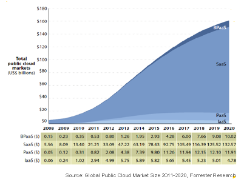
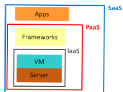

# Cloud Computing

## What is Cloud Computing? 

Cloud Computing is a style of computing in which scalable and elastic IT-enabled capabilities are delivered as a service using Internet technologies [1]. Cloud Computing refers to both the applications delivered as services over the Internet and the hardware and systems software in the datacenters that provide those services. An example for these services is the e-mail service where the user is executing an application which is the email browser through the Internet and at the same time the storage of his inbox is flexible and can be changed according to his needs. The current public cloud market is estimated to be 58.6 billion USD and it is expected to  double within 5 years. 

## Adoption of Cloud Computing 

Cloud Computing can be adopted    on 3 levels; IaaS, Paas and SaaS.  In the IaaS (Infrastructure as a service), the cloud provider  is providing virtualized hardware resources and the users will have to provide the platform (e.g., Operating system), applications and management applications. Examples for IaaS are racspace and amazon. In PaaS (Platform as a Service), the cloud provider is providing hardware resources and a development platform, then the users can use these layers to easily develop applications. Examples for PaaS includes Google App Engine and heroku. In SaaS (Software as a Service), the cloud provider is providing applications, typically accessed via a webbrowser, through the internet. In this case the user is just executing the application. Examples for SaaS are Google (docs,gmail) and salesforce.  The above models of adoption share the following common characteristics:  
1. On demand service: the customer requests for resources through management interface.  
2. Standard access: The users can access it form anywhere through internet.  
3. Resource sharing: Databases and cpu,.. are shard transparently  among unrelated users. 
4. Elasticity: Resources can be scaled according to the consumption. 
5.  Measured services: The consumed resources is monitored and billed according to agreements. The cloud provider may provide her services for public users, in this case it will be called public cloud. On the contrary, the private cloud has its resources installed at the  organization that will use them. In some cases, hybrid approach is applied to keep sensitive data like customer financial data in private part. 

## Case Study on Cloud Computing 

Concern[2], a global humanitarian NGO,  has 4000 employees working  in 30 countries over Asia, Africa and Central America. It builds its worldwide email platform on the cloud to insure efficient communication.  Moving to the cloud computing helps  Concern to harvest the following benefits:   Reducing the cost by shifting the capital expenses to operational expenses  Automating the infrastructure maintenance by shifting it to the cloud provider   Increasing the flexibility and scalability of the recourses.  The results of cloud computing usage was 40% costs reduced .For more info about cloud computing visit 
 
http://www.secc.org.eg/RECOCAPE/Publications.html       

 1. http://www.gartner.com                              

 2. http://www.microsoft.com/eu/impact-on-society/multimedia/cloud-power-helping-to-save-and-transform-lives-in-the-worlds-poorest-.aspx  

## Editors

Iman Ayman El-Dessouki
* E-mail: ieldessouky@itida.gov.eg