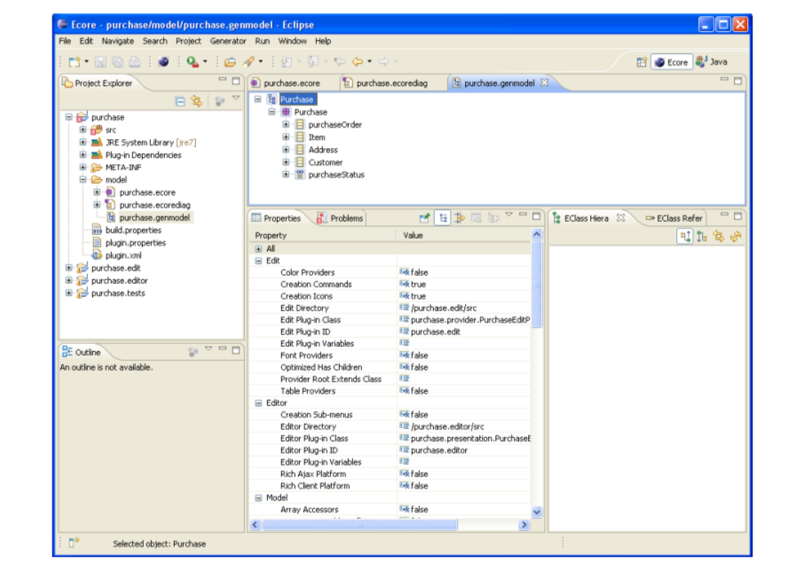

# Getting Started with Model Driven Development and Domain Specific Modeling

## Abstract

As modern systems are becoming more complex so does the need for an approach to increase productivity, reduce rework, and make system integration
and maintainability easier. Model Driven Development (MDD) is introduced as a mean to move the focus of developers from pure coding to analysis and to make system modeling independent of the platform that will be used for system deployment. Using the notion of transformations, MDD can allow a system model to be transformed to the desired programming language on the desired specific platform. This can lead to better portability and interoperability. Domain Specific Languages (DSLs) are fundamental to the concept of MDD. DSLs are modeling languages that target a specific domain and they are typically captured by domain experts.

The aim of this tutorial is to provide an overview about the notion of MDD, review its benefits as well as the challenges that face its adoption. In addition, the tutorial highlights some guidelines to create a domain specific language in practice. Using tools from Eclipse, the tutorial provides a starting point to learn the basics of metamodeling, modeling, and model transformation.


**Keywords**: Model Driven Development (MDD), Model Driven Architecture (MDA), Domain Specific Languages (DSL), Eclipse Modeling Framework (EMF).


## Table of Contents

* [Introduction](#Introduction)
* [Model Driven Architecture (MDA)](#Model_Driven_Architecture)
  * [Types of Models](#Types_of_Models)
  * [MDA Three-Level Architecture](#MDA_Three_Level_Architecture)
* [MDD Benefits](#MDD_Benefits)
  * [Flexible Implementation](#Flexible_Implementation)
  * [Increased Productivity](#Increased_Productivity)
  * [Effective Development, Integration, and Maintenance](#Effective_Development_Integration_and_Maintenance)
* [MDD using Domain Specific Languages (DSLs)](#MDD_using_Domain_Specific_Languages)
  * [What is a Domain Specific Language?](#What_is_a_Domain_Specific_Language)
  * [Advantages of DSL](#Advantages_of_DSL)
  * [Disadvantages of DSL](#Disadvantages_of_DSL)
  * [DSL, UML, and MDD](#DSL_UML_and_MDD)
* [Guidelines to Build a DSL](#Guidelines_to_Build_a_DSL)
  * [Develop and maintain the Metamodel](#Develop_and_maintain_the_Metamodel)
  * [Describe the System Using Multiple Viewpoints](#Describe_the_System_Using_Multiple_Viewpoints)
  * [Validate the Metamodel Keeping the Transformation Simple](#Validate_Metamodel_Keeping_Transformation_Simple)
  * [Create a Useful and Easy-to-Use Code](#Create_Useful_and_Easy_to_Use_Code)
* [MDD Tools Support Using Eclipse](#MDD_Tools_Support_Using_Eclipse)
  * [Eclipse Modeling Framework (EMF)](#Eclipse_Modeling_Framework)
  * [Ecore Metamodel](#Ecore_Metamodel)
  * [Process to Create a Metamodel Using EMF](#Process_to_Create_Metamodel_Using_EMF)
* [Model Transformation](#Model_Transformation)
  * [MOFScript Eclipse Plugin](#MOFScript_Eclipse_Plugin)
  * [Model to Text Transformation Using MOFScript](#Model_to_Text_Transformation_Using_MOFScript)
* [Summary](#Summary)
* [References](#References)


## Introduction
<a name="Introduction"/>

Modern systems are becoming more complex making it increasingly challenging to map requirements to the final product. Managing system complexity and focusing on business needs can be achieved using abstraction and separation of concerns. Modeling is a key approach to do so.

Model-driven Development (MDD) is an approach that represents the software development life-cycle as a modeling and model transformation activities. Models help developers to cope with large and complex systems by allowing them to deal with high level concepts at the right level of abstraction. As a result, the focus of development is moved from writing code for a specific platform to developing an effective solution to satisfy the business needs. Models are used to automate much of the actual coding of applications by generating parts of the Platform Specific Model (PSM) from the Platform Independent Model (PIM) and the actual code from the PSM (to be elaborated later in this tutorial). This way, models are used to drive the code (and not the other way around), keeping the consistency between the model and what the system actually does. MDD gives architects the ability to define and communicate a solution while creating artifacts that become part of the overall solution.

MDD realizes the “Separation of Concerns” principle by separating the business know-how that represents the “WHAT” form of system specifications from the technological know-how that represents the”HOW”. By this, MDD achieves three main objectives; portability, interoperability, and reuse which will eventually lead to an increase in productivity. Domain Specific Languages (DSLs) are very important concept in MDD. DSLs are modeling languages that target a specific domain. It is the responsibility of domain experts to capture domain knowledge into a DSL. Application developers can then use the developed DSL to develop and configure the required system [14].


The very first step to create a DSL is to capture the domain knowledge into a metamodel [16]. Metamodels define the abstract syntax of the DSL [15]. The metamodel should capture the domain definition and scope, domain terminology, and domain concepts and their relationships. A full DSL might be defined using more than one metamodel each describing a certain level of abstraction or a different viewpoint for the given domain. As a result, writing transformations is one of the main activities while defining DSLs. Model transformation is the automatic generation of a target model from a source model, according to a transformation definition. Transformation definition is a set of transformation rules that together describe how a model in the source language (metamodel) can be transformed into a model in the target language (metamodel) [2]. What we need to develop are these transformation rules that take one or more metamodel as an input and generate either text (documentation, code, or configuration scripts) or target models that comply with another output metamodel.


The objective of this tutorial is to provide a starting point to learn the basics of MDD and DSLs. The tutorial covers MDA as a promoted standard for MDD, benefits and drawbacks of MDD, what is a domain specific language and how to define it. To define the language we need to know how to develop metamodels, how to create language editors as well as how to write transformation engines and code/text generators.

The above concepts will be demonstrated using Eclipse-based tools; namely Eclipse Modeling Framework (EMF) for defining metamodels and providing tree-based language editors and MOF Script for writing M2M and M2T  transformations.

The tutorial is organized as follows; section 2 introduces MDA as a promoted standard for MDD. Section 3 discusses the benefits and challenges facing MDD adoption. The definition, advantages, disadvantages, and guidelines to build DSLs are covered in sections 4 and 5. Section 6 and 7 provide hands on experience on tools support for modeling and model transformation using Eclipse tools.


## Model Driven Architecture (MDA)
<a name="Model_Driven_Architecture"/>

Model Driven Architecture (MDA), is a standard promoted by the Open Management Group (OMG). It is an approach to describe IT system specification separating functionality specs from technology platform specs [1]. MDA defines the architecture of models providing guidelines for structuring the specifications that should be represented by these models. One of the main benefits of MDA approach and standards is that it allows the same model to be realized on multiple platforms. This is achieved by defining types of models that represent the system at different levels of abstraction; Business Models and System Models. Transformation between models is a key feature of MDA.

### 2.1 Types of Models
<a name="Types_of_Models"/>

MDA defines two levels of modeling; Business level modeling represented by Computational Independent Models (CIM) and system level modeling represented by Platform Independent Models (PIM) and Platform Specific Models (PSM).


**Computational Independent Model** describes the requirements for a system and the business context in which the system will be used. The model typically describes what a system will be used for, not how it is implemented. CIMs are often expressed in business or domain-specific language and make only limited reference to the use of IT systems when they are part of the business context.


**Platform Independent Model** resolves functional requirements through purely problem-space terms. The model describes how the system will be constructed, without reference to the technologies or platform used to implement the model. Platform Specific Model is a solution model that resolves both functional and non-functional requirements. The model requires information on specific platform related concepts and technologies.

**Model Transformation** is the automatic generation of a target model from a source model, according to a transformation definition which is a set of transformation rules that together describe how a model in the source language can be transformed into a model in the target language. A transformation rule is a description of how one or more constructs in the source language can be transformed into one or more constructs in the target language [2].

### 2.2 MDA Three-Level Architecture

MDA divides the modeling into three layers that are used to finally describe the real world.


* **(M1) Model**: A model is the abstract representation of a part of the function, structure and/or behavior of a system. It is expressed in a well-defined language (syntax and semantics) which is suitable for automated interpretation. Each of the models is defined in the language of its unique metamodel. Example, a UML model should be defined using the constructs defined within the UML specification. In this case UML specification represents the metamodel or the language that will be used to define the model that will represent some or all of the system functionality.

* **(M2) Metamodel**: Is also a model and must be written in a well-defined language (metametamodel). It defines structure, semantics and constraints for a family of models.

* **(M3) Metametamodel**: One unique meta-meta-model, the Meta-Object Facility (MOF). It is some kind of "top level ontology”. MOF provides the standard modeling and interchange constructs that are used in MDA. UML and CWM, are defined in terms of MOF constructs [1]. MOF represents a common foundation for model/metamodel interoperability.

Tools are available to extend current modeling languages such as UML using profiles as well as to build custom languages for specific domains. Both are built on top of MOF or a partial implementation of MOF. Building custom languages with custom metamodels will be discussed later in this tutorial.


## MDD Benefits
<a name="MDD_Benefits"/>

Throughout this section, we will discuss the benefits of MDD as well as some
challenges that face MDD adoption.

### 3.1. Flexible Implementation
<a name="Flexible_Implementation"/>

MDD basic concept is separation of concerns. This allows stakeholders to be focused on a specific domain thanks to abstraction and viewpoints. The horizontal transformation from one PSM to the other or one PIM to the other as well as the vertical transformation between PIM’s and PSM’s or to code makes the implementation very flexible and platform independent. However, to make the best use of these transformations, there is a strong dependence on the quality of models and the quality of transformations. Otherwise getting one model from the other will be buggy and will require lots of rework. It is also important to maintain the modeling approach throughout the project lifetime instead of tweaking the code.


### 3.2. Increased Productivity
<a name="Increased_Productivity"/>

The automation of model and code derivation for different platforms saves both time and effort and reduces the amount of rework required as well as the reduction of loss of information when moving from logical to technical implementation. However, to do this the robust infrastructure should be developed and the team should be trained to move their concern from coding to analysis.

### 3.3. Effective Development, Integration, and Maintenance
<a name="Effective_Development_Integration_and_Maintenance"/>

Since models are derived from each other, therefore the whole system information can be found in one place starting from requirements and ending with code and even test. This improves requirement traceability as well as early testing and simulation. Having all system components as models makes it easier to integrate models rather than code and separates the focus on data integration and functionality integration. Having all this done, it is easier to maintain the system as the documentation, design, and implementation all reside in one place.

## MDD using Domain Specific Languages (DSLs)
<a name="MDD_using_Domain_Specific_Languages"/>

Adopting MDD can be done using current modeling languages such as UML. Extending UML using profiles is a common technique to add specific concepts not already there. However, not all domains can be modeled this way. For example, if a software product line is about creating financial or healthcare applications, it would be easier to use domain concepts to define the solution and automatically generate the rest of the artifacts including documentation and code. Here comes the role of creating your own language. Define the language, define the targets to transform to, define the transformations, and provide the defined framework to developers to create applications in a much faster and error free manner. In this section, we will introduce domain specific modeling as an approach for adopting MDD.

### 4.1. What is a Domain Specific Language?
<a name="What_is_a_Domain_Specific_Language"/>

Domain Specific Language (DSL), is a programming language that is meant to express solutions to problems in a specific domain. This is one definition. However, others see DSL as a complete framework that can define a language or more plus tools and methodologies to generate other artifacts from the main model(s).

We use DSLs in our daily life, for example traffic and road signs, furniture assembly plans, a chess game, and electronic circuits design are all specific languages to target a specific domain.

We need DSL to provide clear comprehension for a specific domain and to easily and effectively communicate with all stakeholders. Domain Specific Modeling, or DSM, provides more expressiveness through visually expressing domain elements.

For IT systems, there are widely used DSLs such as HTML, VHDL and Verilog for hardware description, SQL for relational database queries, and spreadsheets for macros and formulas.


### 4.2. Advantages of DSL
<a name="Advantages_of_DSL"/>

To define a DSL means to extract, capture, encapsulate, structure, and reuse domain expertise and skills. This helps to focus on the specific area by setting a specific scope. This also allows solutions to be expressed at the level of abstraction of the problem domain as well as validating the solution at the domain level.

### 4.3. Disadvantages of DSL
<a name="Disadvantages_of_DSL"/>

DSLs are defined by the domain experts and it is very hard for non-domain experts to maintain or modify the language. Besides, there is an initial cost for defining the language, developing the required tools, and for learning the new language constructs and methodologies.

### 4.4. DSL, UML, and MDD
<a name="DSL_UML_and_MDD"/>

UML is an open standard modeling language that is transferable skill for software developers. As a result, it is of great benefit to use UML profiles (which are extensions to UML for specific domain or platform) as DSLs. UML profiles are light weight and can be implemented using the readily available UML tools making it easy to interpret, recognize, maintain, and transfer between various tools.

If DSLs are based on UML profiles, this will create a large set of related languages with common concepts that are easily understood. This also makes models to be easily integrated. Adding to this the well known advantage of UML that it can


express the system from high-level architecture down to the code which provides the required level of abstraction for DSLs and MDD. However, UML profiles can’t provide concepts that are not already found in UML. For example, UML can’t model electrical circuit diagrams. As a result, in some cases other alternatives must be found to model the system. MOF can be used to define new languages. The rest of the tutorial will introduce how to build a domain specific language by creating the metamodel for this language.


## Guidelines to Build a DSL
<a name="Guidelines_to_Build_a_DSL"/>

This section illustrates the steps and some guidelines to build domain specific language.


### 5.1. Develop and maintain the Metamodel
<a name="Develop_and_maintain_the_Metamodel"/>

Metamodeling is the first step to create a DSL. Since DSL is all about a specific domain, the domain knowledge should be captured and well maintained. Metamodeling is the mean to do so. It is considered as the central asset [13] that grows over time. Incremental development and consulting domain experts is the mean to come up with a good metamodel. Talk Metamodel [13] is the best way to evolve, check, and validate the metamodel is to use it to communicate and exercise it with domain experts, developers, and all stakeholders.

Example:

 * A component owns any number of ports.
 * Each port implements exactly one interface.
 * There are two kinds of ports: required ports and provided ports.
 * A provided port provides the operations defined by its interface.
 * A required port provides access to operations defined by its interface.
 


### 5.2. Describe the System Using Multiple Viewpoints
<a name="Describe_the_System_Using_Multiple_Viewpoints"/>

It is very beneficial to use multiple viewpoints for describing a system, especially complex ones. Viewpoints can be defined based on context and abstraction level. Each viewpoint can have its own metamodel and transformations. Even within the same level of abstraction, the system can be divided into multiple sub-domains each describing a part of the system, example, GUI, persistence, logic, etc. in this case, we need to define a way to link the domains together creating the full system.


### 5.3. Validate the Metamodel Keeping the Transformation Simple
<a name="Validate_Metamodel_Keeping_Transformation_Simple"/>


“Before you do anything else with the model (transformation, generation) make sure you check constraints – these must not be part of the transformation to avoid duplication” [13]. By definition, a buggy model is the model that violates the constraints defined by it is metamodel. One of the most important tips is to avoid writing the constraints within the transformation itself in order to avoid having a complicated transformation. Another reason is to create a robust framework whose constraints hold. For example, if the model is to be transformed to both C++ and java, writing the constraints within the two transformations will be an overhead to check and maintain. However if the constraints are enforced within the main metamodel, this will make the transformation robust, simple, and easy to maintain. A key practice is to include in the transformation only constraints related to the target environment, platform, or metamodel.A key problem is how to keep the metamodel “clean” without platform-specific information and yet make the transformation simple. This can be achieved by adding some metaclasses to the model that contains the required properties. Glue logic then can read the data in the metaclasses and invoke the appropriate transformation.


### 5.4. Create a Useful and Easy-to-Use Code
<a name="Create_Useful_and_Easy_to_Use_Code"/>

Most code generated from tools is neglected by developers. To make the best use
of MDE and the automation resulted for the transformation process, we need to
keep in mind few tips:

   * First of all, make the complete design defining clearly what artifacts are to be generated and what are not. The very final output of the process is not necessarily code. Code, documentation, configuration scripts, or even user manual can be the target output.
   Separate clearly generated and non-generated code.

   * Determine a clear approach that will be used to join or merge generated and non-generated code. For example, generated code can be a library called by non-generated code, or can be plugged in as factories. This can be for example interfaces or design patterns such as factories.

   * Create a readable, nice looking, and documented artifacts that help the developer develop, maintain, and make use the generated artifacts.

   * Make sure that in case of re-generation, the non-generated code is not touched. This can be an option given to the developer during re-generation process.

   * Design a well structured code enforcing constrains to restrict the developers’ freedom and force them write correct code.
   

The above decisions and considerations should be well studied before starting the modeling and transformation process that will finally yield the DSL. The effort required to develop such an automated framework should be compared to the effort required to do the same tasks manually because the initial effort required is one of the drawbacks of MDE that makes it difficult to employ and use within organizations. “Find the right balance between the effort required for automating manual tasks and the effort of repetitively performing manual tasks” [13].


## MDD Tools Support Using Eclipse
<a name="MDD_Tools_Support_Using_Eclipse"/>   


Eclipse is an open source community whose projects are focused on an open
development platform [14]. It is a foundation for building and integration of
tools in a systematic way through being extendible by a plug-in architecture.
Eclipse Modeling Project provides a unified set of modeling frameworks, tooling,
and standards implementations. [11].


### 6.1. Eclipse Modeling Framework (EMF)
<a name="Eclipse_Modeling_Framework"/>   

Eclipse EMF can be used to model your domain model. EMF has a distinction between the meta-model and the actual model. The meta-model describes the structure of the model. A model is then the instance of this meta-model. EMF provides a pluggable framework to store the model information; the default uses XMI (XML Metadata Interchange) to persist the model definition [12]. EMF is the core modeling project in Eclipse Modeling Project (EMP) projects. It consists of three main components [13]:

1. **EMF.CORE**: the main element is the Ecore model. The Ecore model is a part of MOF and is the main model to define the EMF model. Another element is the runtime support which provides model persistence, serialization, change notification, model validation, and a reflective API.
2. **EMF.EDIT**: supports displaying and editing instances of models in a basic tree-editor by providing content and label provider classes, property view and command classes that provide common services and operations. It is used to build the editors and views for the model.
3. **EMF.CODEGEN**: provides Java code generation to build the basic tree-editors.


### 6.2. Ecore Metamodel
<a name="Ecore_Metamodel"/> 


The Domain model is expressed by instantiating the Ecore metamodel which is the implementation of EMOF (Essential MOF).


  * EClass models classes. They have attributes like name and references to other elements and a super type property to support inheritance.
  * EAttribute models attributes. They have a type property. * EDataType is used to represent simple types like EString for modeling strings
  * EReference is used for modeling one end of an associations between classes.


Ecore model, is saved as an XMI file. However it can be created using different technologies other than writing XMI using text editor such as:

  1. Ecore Editors: EMF provides Ecore editors in the both tree-based editor and diagram editor forms.
  2. UML: using a UML modeling tool, EMF supports importing a UML2 model to generate an Ecore model.
  3. XML Schema Definition (XSD): EMF supports importing and transforming an XSD file to an Ecore model by mapping XSD elements to the corresponding Ecore elements. 
  4. Java: using annotations, an Ecore model can be generated form Java interfaces and classes that represent the model.
  


### 6.3. Process to Create a Metamodel Using EMF
 <a name="Process_to_Create_Metamodel_Using_EMF"/> 
 
This section illustrates the process to use EMF to capture the domain knowledge into a metamodel (see Figure 9). A simple and generic example for Purchase Order will be used to help go through the tool capabilities. First of all, Install EMF using the Eclipse Update manager. Select Modeling and install EMF - Eclipse Modeling Framework SDK and Ecore Tools SDK.


#### 6.3.1. Create the Ecore Model


  * Open Ecore perspective
  
  
  * Create a new empty EMF project: File → New → Project... → Eclipse Modeling Framework → Empty EMF Project
  
  
  * Create a new ecore metamodel: New → Other... → Ecore Tools → Ecore Diagram
  
  
  * Create Classes: Here we will not use the visual editor; but rather we will use the normal ecore tree editor. Following is the class diagram of the system to be built.
  
  
  * Add Class Attributes: Attributes can have a predefined type like EString, EInt, etc or a user defined type like EEnum. We need also to define the multiplicity using the upper and lower bound properties.
  
  
  
  * Add Class references: Like a normal UML class diagram, a class can have an attribute that refers to another class. This is done using EReferences. Beside defining the reference class and multiplicity, we need to define if it is is a containment reference. Containment (By-value aggregation) associations are particularly important because they identify the parent or owner of a target instance, which implies the physical location of the object when persisted. Here we define an attribute of Class Item as a containment reference. This means that the purchase order aggregates, by value, 0 0r more items.
  
  
  * Initialize Ecore Diagram: This step will create a visual editor for the created model. The metamodel can be defined either ways.
  
  
  Here is how the model is saved in XMI format

   
#### 6.3.2. Create genmodel from the Ecore model

This will create the Java implementation of the EMF model in the current project.  

  
  
#### 6.3.3. Generated Code and Plugins
 
Here we create the Model, Edit, Editor codes as well as the plug-ins which provide wizards for creating new model instances and an editor which allows entering model information.  
  
  
  
  
  
#### 6.3.4. Run as Eclipse

Here we will run the developed plugin in a new Eclipse instance.


#### 6.3.5. Create a new purchase model

New → Other → Example EMF Model Creation Wizards → Purchase Model.


Start adding model items, attributes, and properties


## Model Transformation
<a name="Model_Transformation"/>
 
Since the systems are becoming more complex, Model to Text (M2T) transformation is required to raise the level of abstraction and automate the development process by automatically generating new artifacts from the same model. This will help increase the software quality while reducing the development time and will help developers to focus on the conceptual and creative parts of the system.

### 7.1. MOFScript Eclipse Plugin
<a name="MOFScript_Eclipse_Plugin"/>

The MOFScript is an Eclipse plugin that aims supporting transformations specifically M2T transformations. However it also supports M2M transformation. It supports the generation of implementation code or documentation from models [15]. It allows usage of any kind of metamodel and its instances for text generation. It has an easy to use interface that allows the generation of text from MOF-based models, e.g., UML models or any kind of domain model as well as producing output files.


MOFScript is a language with flat structure; it consists of a set of rules and methods where neither rules nor transformations can be nested i.e. a transformation can’t invoke another transformation. 

MOFScript language provides function libraries for Strings (size, substring, subStringBefore|After, toLower, toUpper, indexOf, trim, normalizeSpace, endsWith, startsWith, replace, equals, equalsIgnoreCase, charAt, isLowerCase, isUpperCase), collections (Hashmap: put, get, clear, size, keys, values, isEmpty, forEach, List: add, size, clear, isEmpty, first, last, forEach), utilities (generateID, time, date, getenv, setenv, indent, tab, space, position, count) , and UML2 Operations (m.hasStereoType (“stereotype”), m.getAppliedStereotypes (), m.getAppliedStereotype (“named stereotype”), m.getValue (stereoType, “property name”), hasValue (stereoType, “prop name”)) For more about MOFScript language visit http://www.eclipse.org/gmt/mofscript/doc/MOFScript-User-Guide-0.9.pdf


### 7.2. Model to Text Transformation Using MOFScript
<a name="Model_to_Text_Transformation_Using_MOFScript"/>

Taking the same purchasing example, assume we have to create an invoice for the purchase order.

Create a new MOFScript file after running the plugin. A transformation is defined using the keywork textmodule or texttransformation. We need to import the metamodel to work with. We will find our metamodel addressed by the url we specified.

Specify the input and output metamodels in the transformation and specify the entry point rule. Entry point rules defines where the transformation starts execution. In this example the context will be the purchseOrder. Therefore the transformation will run for an input purchase order.

```
	texttransformation purchase2java (in
	mdl:"http://purchase/purchase") {
	mdl.purchaseOrder::main () {
	}
	}
```

Now we will create a file and dump all the data for the purchase order in the file.

```
	file (“Invoice_” + ID + “.invoice”)
```

This implies printing or escaping text. MOFScript provides many ways to do this.

```
	println (“Invoice ID” + ID);OR
	' Invoice ID ' ID
	OR
	<% Invoice ID %> ID
```

Here is the MOFScript code to create an Invoice from the input model.

```
texttransformation purchase2java (in mdl:"http://purchase/purchase") {
	mdl.purchaseOrder::main () {
			var customer:String = self.Customer.ID;
			var invoiceID: String = self.ID;
			var billingAddress: String = self.billingAddress.Name + ', ' +
			self.billingAddress.Country;
			file ("Invoice_" + self.ID + ".invoice");
			// By this all text written afterwards will be dumped in this file
			// No explicit rule for closing a file. To close a file, open a new
			one
			'Invoice:: ' + invoiceID +'\n';
			'Customer::' + customer +'\n';
			'To::' + billingAddress +'\n';
			'Item ID..........Quantity.........Price' +'\n'
			// Loop to add all items
			self.Items->forEach(item:mdl.Item){
			'--' + item.Name + '............' + item.Quantity + '........' +
			item.Price +'\n';
		}
	}
}

```
The transformation output looks like this

```
	Invoice:: Order1
	Customer::Org1
	To::Smart Village, Egypt
	Item ID..........Quantity.........Price
	--PC..................5........5000
	--Printer..................1........1000
```

## Summary
<a name="Summary"/>


Managing complexity and driving requirements that can be easily communicated on all project levels are the main drivers for successful projects. Modeling can achieve these goals by providing the way to express the system on different levels depending on who is going to deal with the system. Separation of concerns and abstraction make it easier to capture system information. Using MDD moves the focus of the developers from pure coding to analysis. This helps solving the problem independent of the technical details of the platform. Thanks to transformations, models can be transformed from one level of abstraction and platform technical knowledge level to the other, inserting new information each step along the way.


Domain specific modeling (DSM) is an approach for adopting MDD. Metamodeling is a key practice to build a domain specific environment. A domain specific environment incorporates domain specific language (DSL) and tools. Capture the domain knowledge in a metamodel, define transformation engine(s) and go for modeling.

Throughout this tutorial, we discussed the main concepts for MDD and demonstrated how to develop a DSL using Eclipse as a common widely used open source platform. Eclipse modeling project provides a very powerful set of tools that can help in realizing the MDD concepts in practice. A simple example was used to illustrate how EMP can be used to develop a domain specific environment. 

Although the initial cost of applying MDD is relatively high, but eventually increase of productivity, system robustness, ease of integration and maintainability can be realized.

## References
<a name="References"/>

[1] OMG Speification - Model Driven Architecture (MDA), Document number ormsc/2001-07-01, Architecture Board ORMSC1, July 9, 2001

[2] A presentation of MDD basics - Model-driven development (MDD) tutorial for managers - ESI - http://www.eclipse.org/gmt/omcw/resources/chapter01/downloads/ AwarenessMDDTutorialForManagers.ESI.ppt

[3] A presentation of MDD basics - Model-driven development (MDD) tutorial for managers – ESI - http://www.eclipse.org/gmt/omcw/resources/chapter01/downloads/ MDDBasics.ESI.ppt

[4] D.L. Giudice, The State Of Model-Driven Development - April 17, 2007 -
www.borland.com/.../en/.../together-forrester-state-of-model-dev.pdf

[5] Peter Kovari, Explore model-driven development (MDD) and related approaches: Applying domain-specific modeling to Model-Driven Architecture http://www.ibm.com/developerworks/library/ar-mdd4/

[6] Tracy Gardner, Explore model-driven development (MDD) and related approaches: A closer look at model-driven development and other industry initiatives http://www.ibm.com/developerworks/library/ar-mdd3/

[7] An introduction to Model Driven Architecture - Alan Brown, Staff, IBM -
http://www.ibm.com/developerworks/rational/library/3100.html

[8] Building Domain Specific Languages with Eclipse and openArchitectureWare http://www.voelter.de/conferences/index/detail228917368.html

[9] A simple DSL to define metamodels http://www.modelum.es/papers/ieeesoftware2007.embedded-dsls.jsanchez.pdf

[10] DSL development: 7 recommendations for Domain Specific Language
design based on Domain-Driven Design http://www.theenterprisearchitect.eu/archive/2009/05/06/dsl- development-7-recommendations-for-domain-specific-language-design-based-on-domain-driven-design

[11] Eclipse Modeling Project http://www.eclipse.org/modeling/

[12] Eclipse Modeling Framework - Tutorial http://www.vogella.com/articles/EclipseEMF/article.html

[13] Model Driven Software Development – MDSD http://www.miloud.webs.com/

[14] MDSE with the Eclipse Modeling Framework I - http://www.zurich.ibm.com/~jku/Teaching/MDSE2011/slides/mdse-04.pdf

[15] http://www.eclipse.org/gmt/mofscript/

[16] MOF Model to Text Transformation – MOFScript - www.eclipse.org/gmt/omcw/.../MOFScriptLecture.SINTEF.ppt


# Editors

Enas Ashraf Ahmed

* E-mail: inas@itida.gov.eg
