# Introduction to SOA


## Abstract

Achieving business agility and easing the integration of legacy systems are main goals for software development in various business organizations. Business agility is the ability to change the business process quickly in response to the change in the business environment, such as adding a new service to the organization portfolio. One way to achieve this in a fast, yet cost effective way is to adopt the Service Oriented Architecture (SOA) approach. SOA is an architecture methodology that views the system as set of services. The service is a software component that implements a reasonable amount of work. Each service is loosely coupled to increase its scalability and reusability. So, whenever a business need emerges and requires adding new functionality to the system, the development team in the organization can develop a service that fulfill that need, and rapidly integrates it in the current system without the need to change the overall architecture of the system. The aim of this tutorial is to introduce SOA and its benefits, and provide a brief overview about the popular implementations of SOA and the concept of Web Services.


**Keywords**: SOA, Service Oriented Architecture, Design Principles, ESB, Enterprise Service Bus, Web Service, SOAP, WSDL, UDDI


## Table of Contents

* [Introduction](#Introduction)
* [What is SOA?](#What_is_SOA)
   * [SOA components](#SOA_components)
   * [Example](#Example)
   * [Design Principles of SOA](#Design_Principles_of_SOA)
   * [Benefits of SOA](#Benefits_of_SOA)
* [Enterprise Service Bus (ESB)](#Enterprise_Service_Bus)
   * [ESB](#ESB)
* [Web Services Approach](#Web_Services_Approach)
   * [Web Service Architecture](#Web_Service_Architecture)
   * [Web service properties](#Web_service_properties)
   * [Web services standards](#Web_services_standards)
* [Case study](#Case_study)
* [Summary](#Summary)
* [References](#References)


## Introduction
<a name="Introduction"/>


A Service Oriented Architecture (SOA) is a design approach for building business applications as a set of loosely coupled black box components orchestrated to deliver a well-defined level of service by linking together business processes [1].

As it is clear from the definition, SOA is an architectural concept which means that it is applied during the early design phase of the development lifecycle. As any software concept, SOA is not suitable for all types of IT applications. For example SOA is not suitable for real-time applications.

When using the SOA approach, business applications are viewed as set of black box components in order to increase the level of abstraction, and hence, ease the reuse of these components. The interaction between these components is simple; such that one component sends a request to another one, and the latter replies back with the requested data or action.

The previous components are combined into subsystems that interface with each other or with the end user in order to deliver services of a particular business value, such as check for duplicate products or calculate effects of change which is higher level business functions for the organization.


## What is SOA?
<a name="What_is_SOA"/>


### 1. SOA components
<a name="SOA_components"/>


Figure 1 depicts the main components of a typical SOA-based solution.

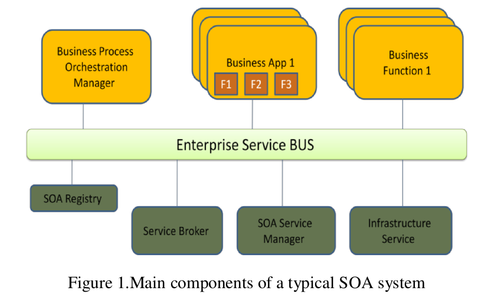

In the following, we briefly define each of the components shown in Figure 1

- Enterprise Service BUS (ESB): It is defined as a set of software components that manage the message routing and transmission from one software component to another. It is also responsible for translating the transfer protocol in case of using different transfer protocols in the communicating software components.
- SOA Registry: It keeps information about each service functionality and location.
- Service Broker: It is responsible for connecting the requester of the service to the provider of the service with the help of the SOA Registry and SOA Service Manager. Instead of hard coding the address of theservice, the requester will communicate with the broker, and then the broker will make the connection between the requester and the provider according to the settled rules.
- SOA Service Manager: It ensures the quality of the services in the SOA architecture.
- Business Process Orchestration Manager: Set of tools to help the system to connect:
  * people to people
  * people to processes
  * processes to processes

### 2. Example
<a name="Example"/>

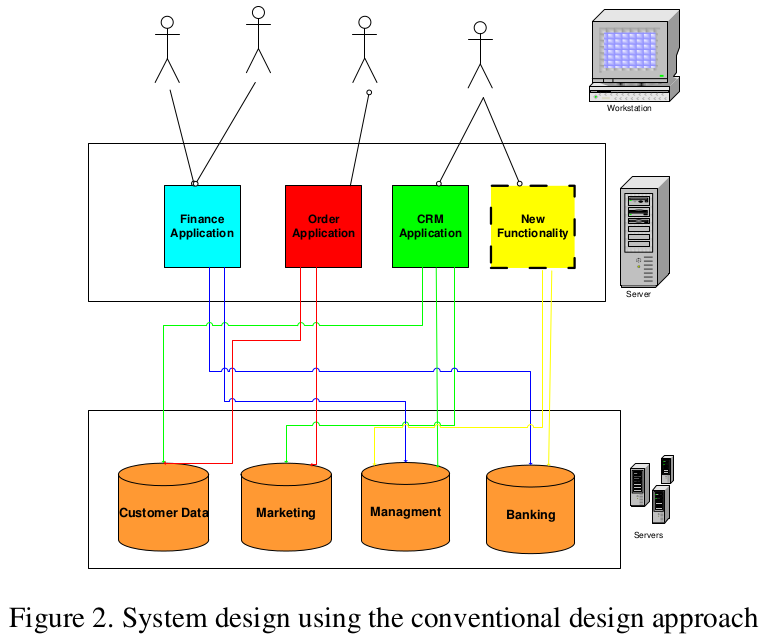

To demonstrate the idea of using SOA, we consider the following simple example. The conventional design approach is first explained, then the SOA-based design approach is discussed. Company X is working in the field of insurance. It owns a legacy system ( Figure 2 ) that enables company employees to view and edit customer data and calculate various rates according to the customer requests. Due to company expansion and business need for offering new services to the customers, the IT department must add a new functionality to the System. Accordingly, The IT development team has upgraded the system and found that they should retest the whole system to make sure that’s the original functionalities are still functioning normally. In this case, the development team will need to retest both the old and the new added functionalities.


If the company has have used the SOA approach , the development team would have viewed the system as set of services including the old functionalities and the new proposed functionality, as shown in Figure 3 .

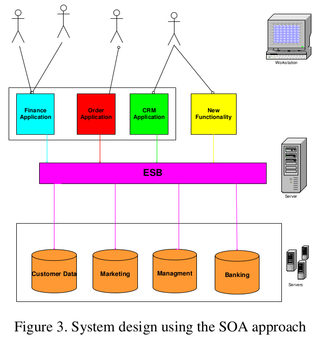

As shown in the figure, the system uses ESB, service registry, and the legacy system is wrapped up with communication interface in order to connect to the ESB. Now, the new service can be developed and linked to the ESB without the need to know the internals of the legacy system. Also, a set of reusable data services is developed in order to access the data servers and make the CRUD functions. These services will be used by the old system as well as any new developed services.


In this new design, testing can be done on the new services and the interface part only of the old components.


### 3. Design Principles of SOA
<a name="Design_Principles_of_SOA"/>

The core of the SOA approach is to have various units of solution logic represented and exposed as services. This necessitates the development of practices and standards in order to help software developers to identify designs and design services.


SOA design principles are generalized, accepted industry practices for providing rules and guidelines that determine exactly how solution logic should be decomposed and shaped into software services. So, the consistent application of service-orientation design principles leads to the creation of services with functional contexts that are agnostic to any business process or application. These agnostic services are therefore capable of participating in multiple service compositions achieving the ultimate goal of SOA [4].

The service-orientation paradigm advocates the following nine distinct design principles, each of which supports fundamental design characteristics that form the target solution logic as service oriented[5].

The following is a brief description of each principle accompanied with an illustrating figure [3]:

- **Principle 1**: Standardized service contract

All service description, purpose, communication protocol, and message format should be documented in a service contract. In order to make all clients understand this contract, it should be written in a standard-based service description format as demonstrated in Figure 4.

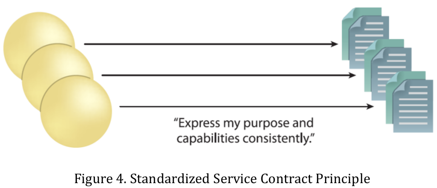

- **Principle 2**: Loose coupling 

Loose coupling emphasizes that services should be designed to have minimal dependencies on each other by achieving logical separation of concerns. The services shouldn’t be tightly- coupled as demonstrated in Figure 5 . Different layers of loose coupling should be achieved while designing services, starting from the service contract, ending with service implementation. For example, when the service provider is changed or removed, this will require changing the service consumer. So, it is better to keep these dependencies to minimum in order to reduce the required changes when an upgrade in the system is needed.

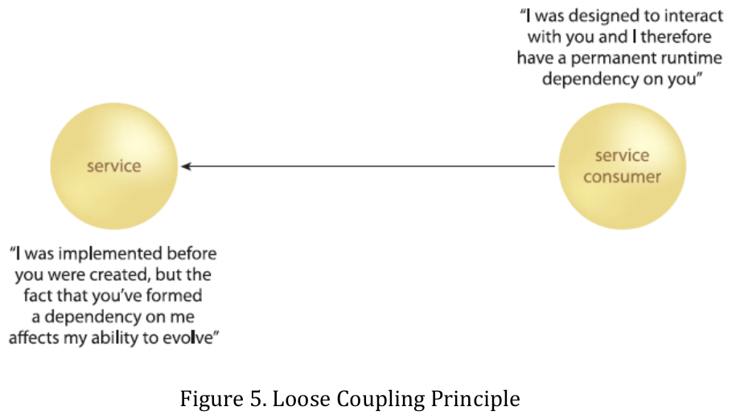

- **Principle 3**: Service abstraction

Services encapsulate the logic they provide from the outside world avoiding the proliferation of unnecessary service information internal implementation, technology, logic, and function away from users of the services as shown in Figure 6 . This helps greatly in developing applications without the need to review, and analyze unimportant details about the system.

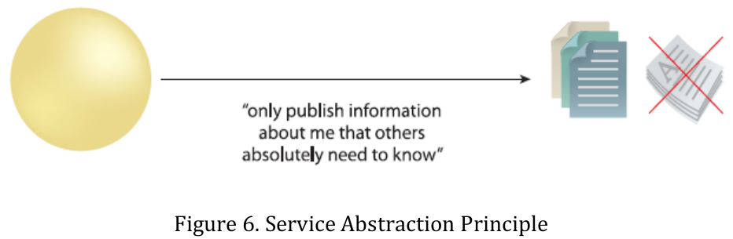


- **Principle 4**: Service reusability

Reusability implies that the solution logic is divided into services with the intent of maximizing reuse. The services must contain and express agnostic logic and can be positioned as reusable enterprise resources. Service reusability represents a design principle that should be considered during service design as well as an imperative goal of SOA. Figure 7 illustrates the idea of service reuse by comparing the design of two applications required to provide the same functionality at the present time. But reusability requires special consideration to balance the required developing effort and time with the benefits to be achieved in the future. For example, separating a service like calculate taxes as stand-alone service and reusing it in the application will add a clear overhead in the time needed for the service design and development. However, on the other hand, when the rules and regulations of taxes changes over time, the only place that requires upgrade is the “calculate taxes” service.

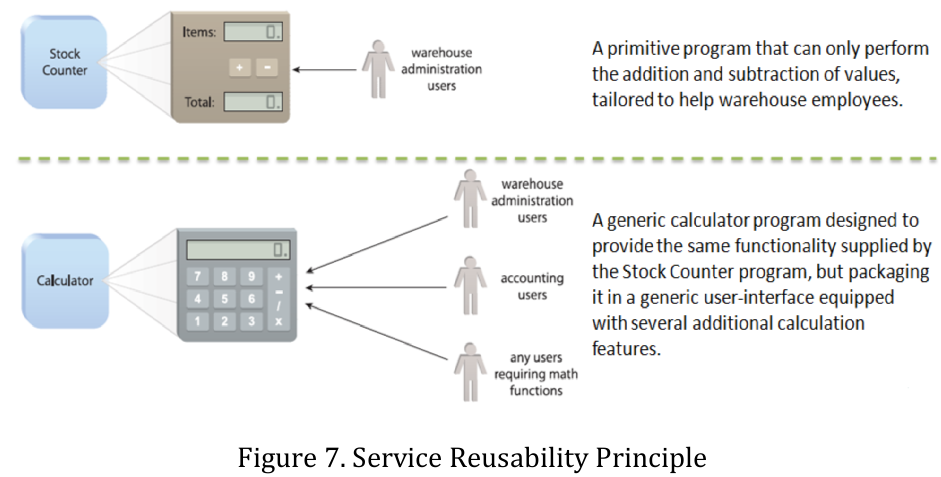

- **Principle 5**: Service autonomy

This principle ensures that the service benefit is acquired only by the service implementation, and thus, no service is controlled by another service as demonstrated in Figure 8 . Two primary benefits are achieved when applying service autonomy; system reliability and behavior predictability.

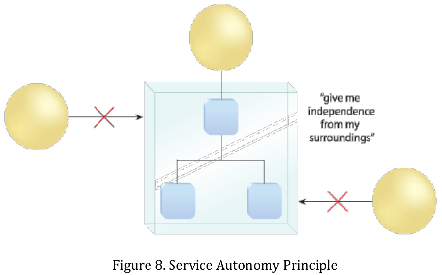

- **Principle 6**: Service statelessness

In distributed architectures, it is important to keep track of the interactions history between the server and client parts of the system. However, to make the architecture scalable (i.e. can reliably support large number of requests), it is a good practice to follow the Service  Statelessness principle.

Service statelessness suggests differing state information as much as possible in order to minimize resource consumption. As shown in Figure 9 , service statelessness encourages incorporating state management deferral approach within service designs so as to keep services in a stateless condition wherever appropriate. For example, this can be done using a separate component which keeps track of the states of the services (e.g. storing session data in a database)

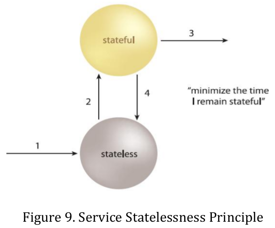

- **Principle 7**: Service discoverability

Applications should learn about the services of the system in a systematic way. This service discoverability principle implies two requirements: 

	1. service contracts are equipped with appropriate metadata. 
	2. a service registry exists in order to store the service description records as shown in Figure 10.
	
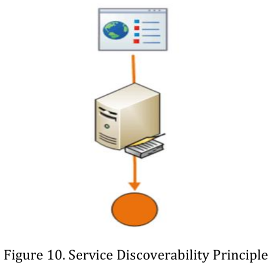

- **Principle 8**: Service composability

Services are designed as reusable units that can be reconfigured easily to reflect new requirements and business processes, and thus, can be used in different applications. This principle affects directly the business agility. So any application will be composed of any number of services as shown in Figure 11.

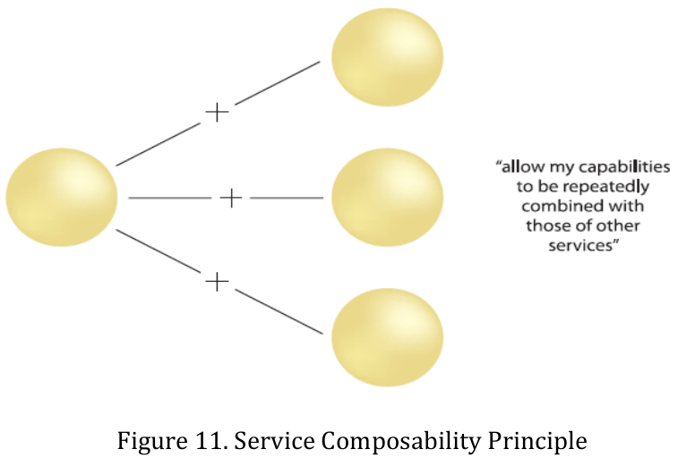


- **Principle 9**: Service interoperability

In many real applications, it is possible that the service consumer runs on a different platform other than that of the service provider. In this case, it will be difficult for them to interact unless they both agree on the same standard for interaction. Service interoperability necessitates the usage of standards that allow diverse subscribers to use the service. Thus, a special care should be given to the used transport protocols and message formats while designing the services to enable various types of clients (e.g. web browsers, desktop front-end ,etc.) to use these services as shown in Figure 12.

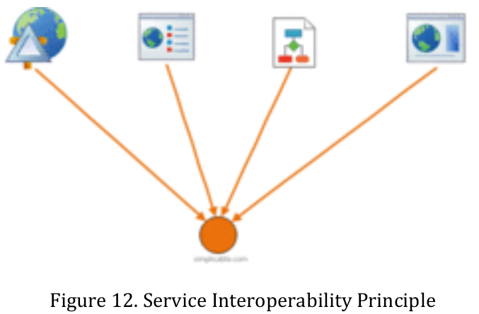


### 4. Benefits of SOA
<a name="Benefits_of_SOA"/>

The increasing complexity of business processes and systems coupled with the rapid changes in market needs and business requirements; and agility, flexibility, and business automation have became vital for enterprises to survive [4]. SOA is a strong candidate paradigm for the realization of the agility, flexibility, and automation of the business processes that span large distributed systems. It is an approach that can support systems to remain scalable and flexible while growing. Companies that need customizable solutions or use IT for competitive value, companies seeking to leverage IT capabilities for business advantage, these are companies that should care about SOA. The SOA supports the realization of these strategic goals ,that enables business and IT to collaborate in order to achieve:

* Greater flexibility in strategic applications
* Faster time to value from IT
* Modernized strategic applications
* Lower the lifetime cost of applications or infrastructure
* Reuse as a goal to bring products or capabilities to the market faster


SOA provides the potential to elevate the responsiveness and cost-effectiveness of IT through a design paradigm that emphasizes the realization of strategic goals and benefits. Figure 13 presents SOA benefits at technical and business dimensions.

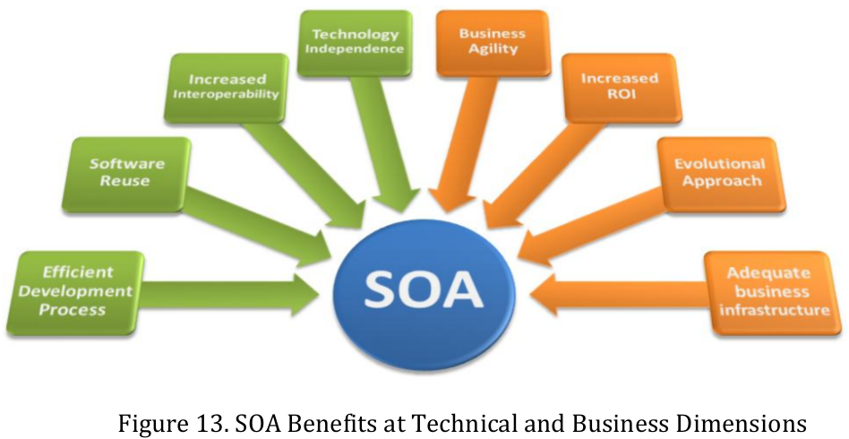


## Enterprise Service Bus (ESB)
<a name="Enterprise_Service_Bus"/>

### 1. ESB
<a name="ESB"/>

Enterprise service bus (ESB) represents the core infrastructure of any SOA implementation. Enterprises commonly deploy diverse applications, platforms, and business processes communicating to each other using incompatible data formats and communications protocols. Accordingly, ESB simplifies the complexity of integration by providing a single, standards-based infrastructure into which applications can be plugged as demonstrated in Figure 14 . Once plugged into the ESB, an application or service has access to the entire infrastructure services like data transformation, transport mediation and others provided by the ESB. Moreover, the application can access any other application that are also plugged into the ESB. For instance, one could plug a billing system based on JMS into an ESB and use the ESBs transport mediation features to expose the billing system over the Web using SOAP/HTTP. You could also route internal purchase orders directly into the billing system by plugging the Purchase Order system into the ESB [5].

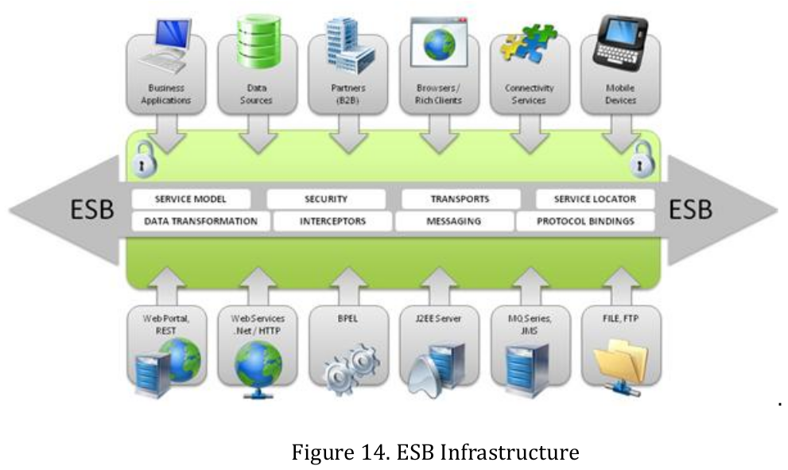


To run SOA in practice, one need a way for calling services. ESB is mainly a group of applications that provides various intermediation services for the enterprise applications to be able to call and talk to each other. The service provided by each ESB varies from one to another depending on the complexity, scalability, and the cost of the final solution. Commonly, the following are the main services and functionalities that are provided by an ESB:

* Data transformation: Applications are using different data formats and message structures to represent real world concepts. Thus, ESB comes as an intermediary that translates from one format to another supporting different formats and message structures allows greater flexibility and scalability for the target solution.
* Transport mediation: Various transportation protocols are used in	enterprise applications, and hence, integrating such applications requires	efficient mediation between various transportation protocols.
* Intelligent routing: In order to achieve achieving scalable self-functioning solution, the system must have the capability to route messages based on their contents and priorities, while achieving load balancing between several service providers. This feature requires the ESB to have some semantic understanding of at least some parts of the services.
* Security: only authorized and authenticated service users for a certain service are capable for consuming that service. Also, messages that contain sensitive information may need to be encrypted at runtime.

In addition to the previous main features, ESBs usually provide add-on services, such as: real-time monitoring, logging, service management, hot deployment,	service replications, and testing services.


## Web Services Approach
<a name="Web_Services_Approach"/>

Web services are one of the common used approaches to realize the concept of SOA. One definition of web services is [8]: “A self-contained, modular	applications that can be described, published, located, and invoked over a	network”.

Web services can execute different sized business functions e.g., simple data requests or wrapping legacy system to make them network enabled. It can also call other web services to achieve certain business function. These web services will be called by the frontend application in order to achieve specific functions to the user.

### 1. Web Service Architecture
<a name="Web_Service_Architecture"/>

Figure 15 demonstrates the architecture of a solution based on web service approach.

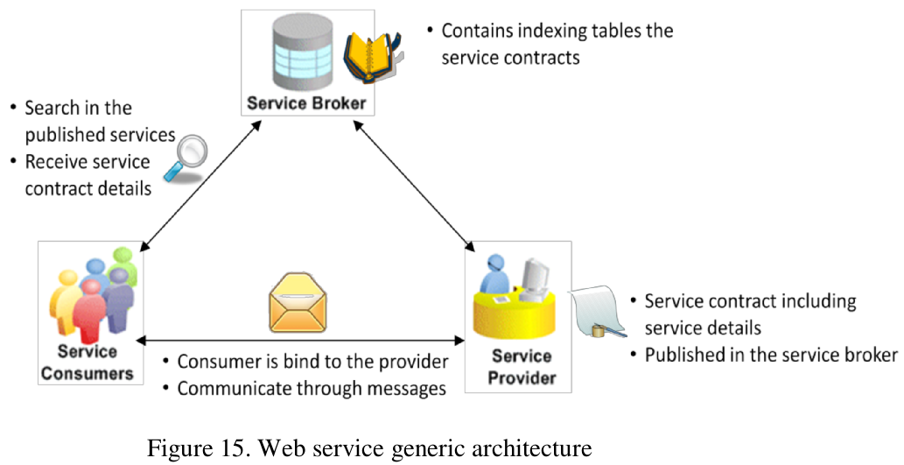

The main components shown in Figure 16 are as follow:

* **Service provider**: is the component that implements the web service and informs its existence to other requester by publishing its interface and access information in the service registry.
* **Service broker (registry)**: is responsible for the availability of both interface and implementation access information for the Web service to any service requester.
* **Service requester**: searches the service within the service broker to find its service provider then connect to the latter using specific communication protocol.

### 2. Web service properties
<a name="Web_service_properties"/>

The key properties that characterize the web services could be summarized as follow:

Standardization: Web services depend on mature and well known
standards.
* Exposure: Web services depend on well known standard like SOAP, WSDL, and UDDI, which allow them to make use of the existing infrastructure to be invoked across the Web.
* Modularity: Web service functionality can be implemented using smaller web services in order to increase their reusability of the web services.
* Interoperability: The service provider and the service requester could be developed using different languages on different machines. They can also run on different platforms.

### 3.Web services standards
<a name="Web_services_standards"/>

The following are the core standards in implementing web services. Other standards exist that address web service security, web service management and others.

* **SOAP**: (Simple Object Access Protocol) is the standard format for the messages between the web service architecture components. As shown in Figure 17, it is based on XML (Extensible Markup Language), and it is independent of programming languages.

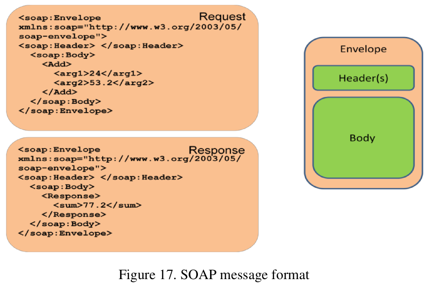

* **WSDL**: Web Services Description Language is also based on XML and it describes the implementation of a service. It is used by both the service provider and the service requester. The service provider specifies the operations that he provides and the parameters and data types of these operations. The WSDL document includes the information about the location of the web service and message format. An example of a WSDL document in shown in Figure 18 .

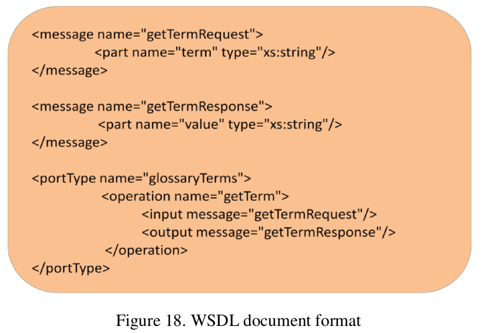

* **UDDI**: Is a web service, like yellow pages, that can be used to register the description about the web services and make it available for other service requesters to discover. For example, If the industry published an UDDI standard for flight rate checking and reservation, airlines could register their services into an UDDI directory. Travel agencies could then search the UDDI directory to find the airline's reservation interfaces. When the interface is found, the travel agency can communicate with the service immediately because it uses a well-defined reservation interface.

Table 1 summarizes the core standards of web services.

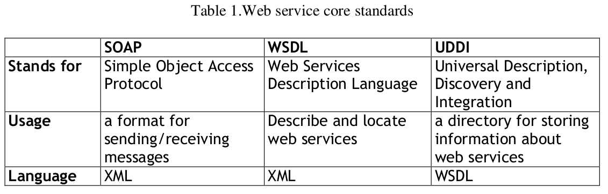

* **Application Transfer Protocol**:

The components in the web service architecture make use of the following protocols to send messages to one another:
  * Hypertext Transfer Protocol (HTTP)
  * Simple Mail Transfer Protocol (SMTP)
  * File Transfer Protocol (FTP)
  * Blocks Extensible Exchange Protocol (BEEP)
  
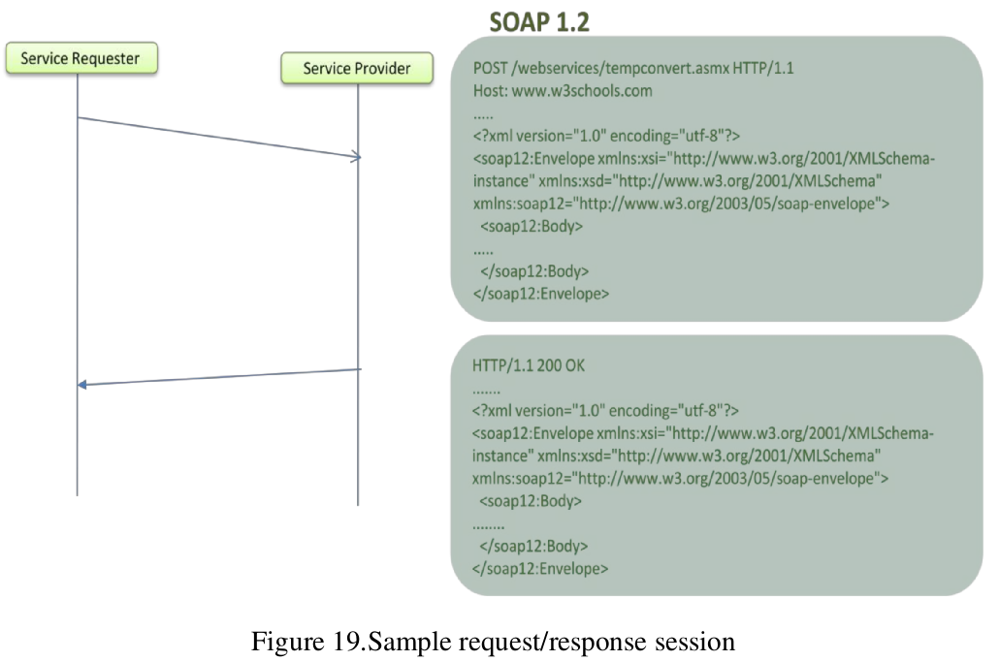

The body of the requester message will be something like this:

```
<m:GetPrice>
<m:item>Apples</m:item>
</m:GetPrice>
```

And the provider will fill XML-message with the reply as the following:

```
<m:GetPriceRsponse>
<m:price>1.90</m:price>
</m:GetPriceRsponse>
```

## Case study
<a name="Case_study"/>


This case study is practiced in [9] and is used here to demonstrate the usage of the SOA approach. A company provides financial services like retirement savings plans, discount brokerage services, retirement services, estate planning, wealth management, securities execution and clearance, and life insurance and much more. The company employees utilizes several desktop application to serve the clients like making financial transaction, inquiring accounts and funds, resource management and relationship management.

The previous scenario caused the following problems in the company:

* The client data is fragmented
* Gathering the data together while servicing the client was inefficient
* Each application implemented its method of implementation

- Which increase the time and cost to change the organization business process. So the company decided to develop a single application interface linked to a centralized client data storage to overcome the above mentioned problems.

- In 2002, the company started by forming a development team to begin a pilot project to proof the idea of using services to support application. The result was 20 Java services that were used by 3 different applications (web services). Also a great experience was acquired on how to migrate from the previous tightly coupled applications to the loose coupled web services.

- In2004, the company began to develop new application for company employees depending on the experience they gain from the pilot project. The application has the following feature:

   * Single user interface for all users
   * Centralized data source	
   * Several subsystems to support related set of functionality based upon .Net framework
   * Uses XML/HTTP web services to connect to data source and to the subsystems

- Later, in 2005: there were 200 unique services that supported both mainframe and distributed applications throughout the organization.


In order to implement such a huge project, there must be rules to be followed by the organization IT team. In particular, the following governance processes more adopted:

- Defining the web service or business service using WSDL format in a document that defines:
  * service name
  * request document
  * response document
  * SOAP fault codes and messages
  * visibility for designers-developers-testers
  * Operational definition
  
- Defining standards to be used by each developer:
  * Logging
  * Authentication
  * Authorization
  * SOAP headers
  * Errors for SOAP fault
  * business specific XML
  * logical access to the physical databases

- Creating centralized repository to store any metadata about each service like request and response documents, WSDL references, database tables that were accessed, producing project, application dependencies, etc.
  * This helps analysts to find the current version of services in the system
  * Data engineer can quickly find the information about the services that access certain column in the database in order to do impact analysis for changes in the database.
  * also this repository is integrated to the management tools to help release manager to produce reports for release meeting.
  
## Summary
<a name="Summary"/>

This tutorial briefly introduced the basic concepts of SOA and its components. It also provided a brief introduction about web services as one of the widely used approaches to implement SOA. A sample case study is outlined to help clarify the concepts and benefits of adopting the SOA approach.

## References
<a name="References"/>

[1] Service Oriented Architecture For Dummies, 2nd IBMLimited Edition

[2] OASIS Reference Model for Service Oriented Architecture 1.0

[3] http://www.omg.org/technology/readingroom/SOA.htm

[4] James Bean, "SOA and Web Services Interface Design: Principles, Techniques, and Standards", 1st edition, Morgan Kaufmann publications, 2009.

[5] Thomas Erl, "SOA Principles of Service Design", 1st edition, Prentice Hall publications, 2007.

[6] Michael Rosen, Boris Lublinsky, Kevin T. Smith, and Marc J. Balcer, "Applied SOA: Service-Oriented Architecture and Design Strategies", 1st edition, Wiley publications, 2008.

[7] Rick Robinson, "The role of the Enterprise Service Bus", IBM developer Works, 2004.

[8] Web Services Handbook for WebSphere Application Server 6.1

[9] A. Coppola, S. Li,” A CASE STUDY OF SERVICE ORIENTED ARCHITECTURE IMPLEMENTATION AND GOVERNANCE”, Proceedings of the 39th Annual Meeting of the Decision Sciences Institute, November 22-25, 2008,pp 5041-5046.


## Editors

Mahmoud Mohamed AbdAllah
* E-mail: mmabdallah@itida.gov.eg
